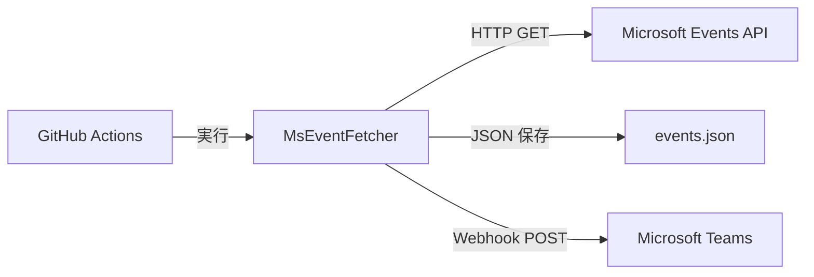
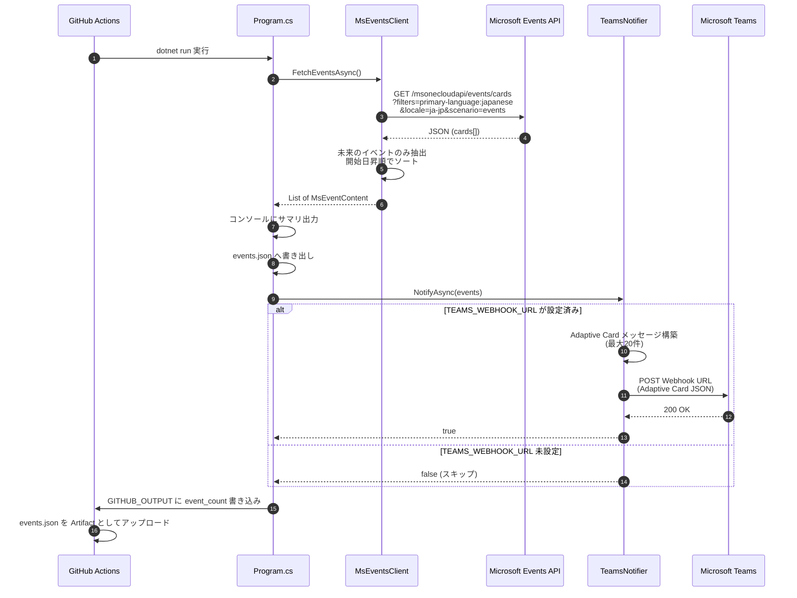

# MsEventFetcher

Microsoft 公式イベントカタログから **日本語で開催されるイベント** を自動取得し、JSON ファイルへの保存と Microsoft Teams への通知を行う .NET 10 コンソールアプリケーションです。

GitHub Actions により毎週月曜 9:00 (JST) に自動実行されます。

---

## アーキテクチャ



---

## 処理フロー



---

## 入出力情報

### 入力 (環境変数)

| 環境変数 | 必須 | デフォルト値 | 説明 |
|---|---|---|---|
| `TEAMS_WEBHOOK_URL` | いいえ | _(なし)_ | Teams Incoming Webhook の URL。未設定時は Teams 通知をスキップ |
| `EVENT_OUTPUT_PATH` | いいえ | `events.json` | イベント JSON の出力先ファイルパス |
| `GITHUB_OUTPUT` | いいえ | _(なし)_ | GitHub Actions が自動設定。`event_count` を書き込む |

### API リクエスト

| 項目 | 値 |
|---|---|
| エンドポイント | `https://www.microsoft.com/msonecloudapi/events/cards` |
| メソッド | `GET` |
| 主要パラメータ | `filters=primary-language:japanese`, `locale=ja-jp`, `scenario=events` |
| User-Agent | `MsEventFetcher/1.0` |

### 出力

| 出力先 | 形式 | 内容 |
|---|---|---|
| コンソール (stdout) | テキスト | イベントごとの日時・タイトル・URL・形式のサマリ |
| `events.json` | JSON 配列 | 取得した全イベントの詳細情報 (下記参照) |
| Teams チャネル | Adaptive Card | イベント一覧 (最大20件)。タイトル・日時・場所・詳細リンク付き |
| `GITHUB_OUTPUT` | Key=Value | `event_count=<件数>` |

### events.json のスキーマ

| フィールド | 型 | 説明 |
|---|---|---|
| `id` | `string` | イベント固有 ID |
| `name` | `string` | イベント名 |
| `title` | `string` | 表示用タイトル |
| `description` | `string` | イベント概要 |
| `format` | `string` | 開催形式 (例: `デジタル`) |
| `formatEnglishName` | `string` | 開催形式の英語名 (例: `Digital`) |
| `action.text` | `string` | アクションラベル |
| `action.href` | `string` | イベント詳細・登録ページの URL |
| `location.city` | `string?` | 開催都市 (オンラインの場合 `Digital`) |
| `location.state` | `string?` | 開催地の州・都道府県 |
| `location.country` | `string?` | 開催国 |
| `eventDates.startDate` | `string?` | イベント開始日時 (ISO 8601) |
| `eventDates.endDate` | `string?` | イベント終了日時 (ISO 8601) |
| `location.state` | `string?` | 開催地域 |
| `location.country` | `string?` | 開催国 |
| `eventDates.startDate` | `DateTimeOffset` | 開始日時 (UTC) |
| `eventDates.endDate` | `DateTimeOffset` | 終了日時 (UTC) |

---

## プロジェクト構成

```
MsEventFetcher/
├── Program.cs                  # エントリポイント
├── MsEventFetcher.csproj       # プロジェクト定義 (.NET 8)
├── Models/
│   ├── MsEvent.cs              # API レスポンスモデル
│   └── TeamsMessage.cs         # Adaptive Card メッセージモデル
├── Services/
│   ├── MsEventsClient.cs       # Microsoft Events API クライアント
│   └── TeamsNotifier.cs        # Teams Webhook 通知
└── .github/
    └── workflows/
        └── fetch-ms-events.yml # 定期実行ワークフロー
```

---

## セットアップ

### 前提条件

- .NET 8 SDK

### ローカル実行

```bash
# Teams 通知なしで実行
dotnet run

# Teams 通知ありで実行
TEAMS_WEBHOOK_URL="https://xxx.webhook.office.com/..." dotnet run
```

### GitHub Actions

リポジトリの **Settings > Secrets and variables > Actions** に以下を設定:

| Secret 名 | 説明 |
|---|---|
| `TEAMS_WEBHOOK_URL` | Teams Incoming Webhook の URL |

ワークフローは以下のタイミングで実行されます:

- 毎週月曜 9:00 JST (cron スケジュール)
- `main` ブランチへの push (`.cs` / `.csproj` / ワークフロー変更時)
- 手動実行 (`workflow_dispatch`)
